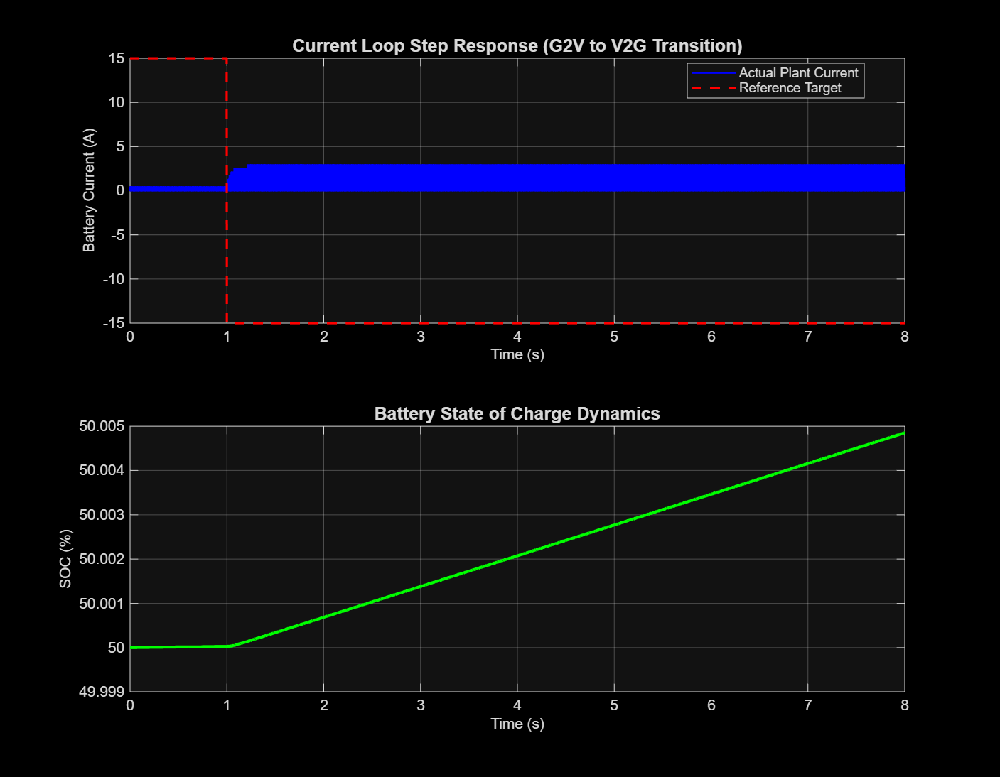

# Bidirectional EV Charger (V2G & G2V)

A MATLAB/Simulink R2026a simulation of a non-isolated bidirectional half-bridge DC-DC converter, designed to demonstrate Vehicle-to-Grid (V2G) and Grid-to-Vehicle (G2V) power flow.

## Architecture
* **`Models/`**: Contains the Simscape Electrical plant model.
* **`Scripts/`**: Contains the initialization parameters (`init_params.m`) and data visualization scripts (`analyze_results.m`) to completely decouple variables from the physical model.
* **`Data/`**: Storage for workspace simulation outputs.

## Control Strategy
The converter utilizes a discrete Proportional-Integral (PI) current control loop with anti-windup clamping to track step-current reversals. Battery State of Charge (SOC) is calculated independently via Coulomb counting logic.

## Results
The system maintains stable tracking during a 30A reversal (-15A to +15A), smoothly transitioning the battery from discharge to charge mode.

